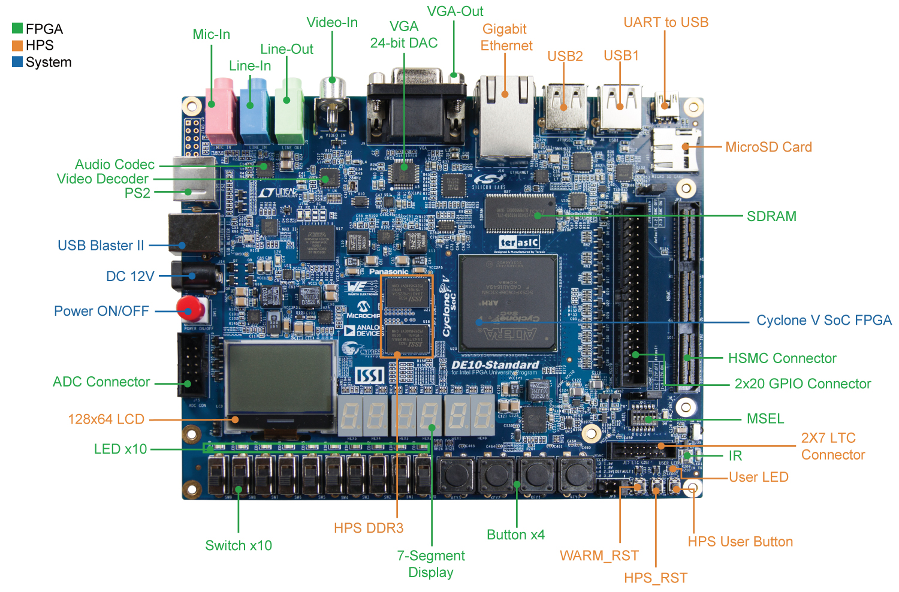
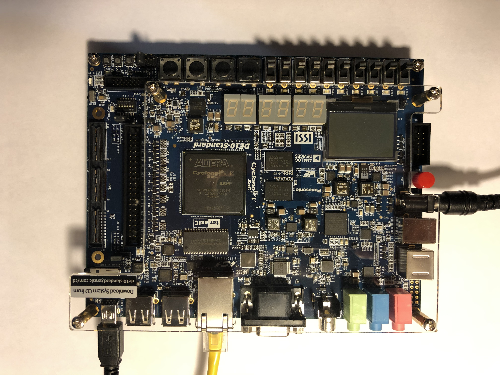
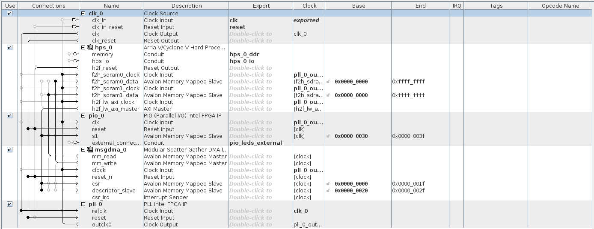
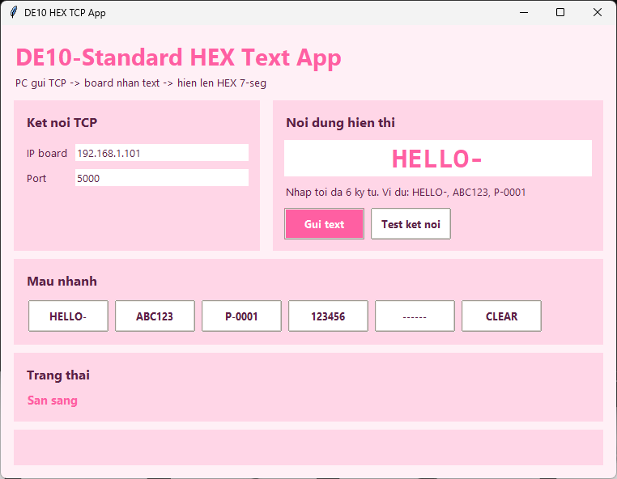
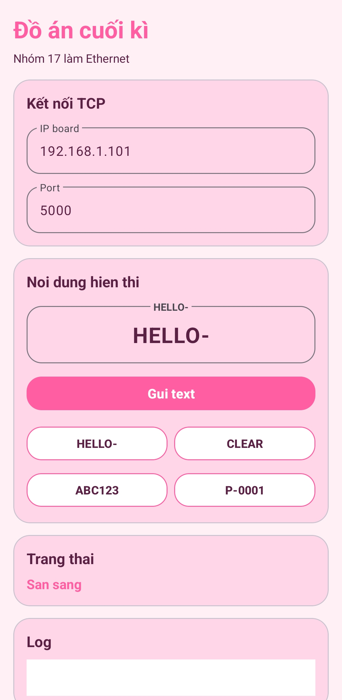

<p align="center">
  
</p>

<h1 align="center">⚙️ Đồ án Hệ thống nhúng - SoC Ethernet trên DE10-Standard</h1>

<p align="center">
  <a href="https://github.com/lhlizdabezt/DoAnHeThongNhung/releases/latest"></a>
  
  
  
  
</p>

<p align="center">
  
</p>

<p align="center">
  
  
  
</p>

<p align="center">
  
</p>

---

## 🧭 Tóm tắt đồ án

Repo này lưu mã nguồn, tài liệu báo cáo, slide và tài sản minh chứng cho **Đề tài 13 - SoC Ethernet tích hợp hệ thống, firmware và ứng dụng nhận lệnh TCP từ PC** của **Nhóm 17 - 22DTV_CLC**, học phần **Thực hành Hệ thống nhúng**, Khoa **Điện tử - Viễn thông**, Trường Đại học Khoa học Tự nhiên, ĐHQG-HCM.

Hệ thống dùng board **Terasic DE10-Standard Cyclone V SoC FPGA**. PC hoặc thiết bị Android gửi chuỗi ký tự qua **TCP/Ethernet**, phía **HPS/Linux** trên board tiếp nhận payload, chuẩn hóa dữ liệu, ghi xuống vùng ngoại vi FPGA qua bridge HPS-FPGA và hiển thị kết quả lên cụm **LED 7 đoạn HEX0..HEX5**.

## 🎯 Giá trị kỹ thuật nổi bật

| Năng lực thể hiện | Bằng chứng trong repo | Ý nghĩa khi HR/kỹ sư review |
| --- | --- | --- |
| Tích hợp phần cứng và phần mềm | Quartus, Platform Designer, HPS/Linux, PIO, LED 7 đoạn | Cho thấy khả năng nối luồng từ board thật đến phần mềm điều khiển |
| Giao tiếp mạng nhúng | TCP/IP qua Ethernet, router LAN, PC/Android client | Có tư duy hệ thống, endpoint, request/response và kiểm thử kết nối |
| Firmware và ứng dụng điều khiển | C/C++, script HPS, Python/Tkinter GUI | Có thể làm từ tầng thấp đến giao diện người dùng |
| Tài liệu kỹ thuật có thể review | Báo cáo PDF, slide PDF, Typst source, PowerPoint blueprint, release/tag | Repo không chỉ là nơi chứa file, mà là hồ sơ kỹ thuật có cấu trúc |

## 🧩 Kiến trúc tổng quan

```text
PC GUI / Android client
        |
        | TCP/IP qua Ethernet LAN, cổng dịch vụ 5000
        v
HPS Linux trên DE10-Standard
        |
        | Chuẩn hóa payload, phản hồi OK/ERR, ghi thanh ghi ngoại vi
        v
Lightweight HPS-to-FPGA bridge
        |
        v
FPGA fabric / PIO
        |
        v
LED 7 đoạn HEX0 - HEX5
```

<p align="center">
  
  
</p>

## 📦 Tài liệu và artefact chính

| Hạng mục | Link | Ghi chú |
| --- | --- | --- |
| Báo cáo đồ án | [17_TH_HTN_22DTV_CLC.pdf](./17_TH_HTN_22DTV_CLC.pdf) | Báo cáo học thuật 35 trang, có phân công, kiến trúc, quy trình và minh chứng |
| Slide bảo vệ | [17_TH_HTN_22DTV_CLC_presentation.pdf](./17_TH_HTN_22DTV_CLC_presentation.pdf) | Slide 16:9 dùng để trình bày luồng PC GUI -> TCP -> HPS Linux -> Bridge -> HEX |
| Source slide | [17_TH_HTN_22DTV_CLC_presentation.typ](./17_TH_HTN_22DTV_CLC_presentation.typ) | Nguồn Typst để tái dựng slide |
| PowerPoint blueprint | [SoC_Ethernet_Integration_Blueprint.pptx](./SoC_Ethernet_Integration_Blueprint.pptx) | Bản trình bày kỹ thuật dạng PPTX |
| Release GitHub | [v1.0.0](https://github.com/lhlizdabezt/DoAnHeThongNhung/releases/tag/v1.0.0) | Đóng gói báo cáo, slide, Typst source và PowerPoint cho người review tải nhanh |

## 🧰 Công nghệ sử dụng

| Lớp hệ thống | Công nghệ |
| --- | --- |
| Phần cứng | Terasic DE10-Standard, Cyclone V SoC FPGA, LED 7 đoạn HEX0..HEX5 |
| Thiết kế FPGA | Intel Quartus Prime, Platform Designer, VHDL/HDL, PIO, HPS-FPGA bridge |
| Hệ điều hành nhúng | Embedded Linux trên HPS, cấu hình Ethernet, shell script |
| Phần mềm nhúng | C/C++, memory-mapped I/O, xử lý payload, phản hồi OK/ERR |
| Ứng dụng điều khiển | Python 3, Tkinter GUI, socket TCP, Android client kiểm chứng endpoint |
| Tài liệu | Typst, PDF, PowerPoint, GitHub release, tag, topic, description |

## 🚀 Chạy nhanh GUI trên PC

Yêu cầu máy tính có **Python 3**.

```powershell
python DoAn\pc_hex_tcp_pink_gui.py
```

Trong giao diện, nhập **IP của board DE10-Standard**, cổng TCP mặc định `5000` và chuỗi cần gửi. Payload nên giới hạn tối đa **6 ký tự** để khớp với 6 LED 7 đoạn từ `HEX0` đến `HEX5`.

## 🔌 Cấu hình Ethernet trên board

Trên terminal Linux của DE10-Standard, có thể cấu hình nhanh Ethernet bằng:

```sh
ifconfig eth0 up
udhcpc -i eth0
ifconfig eth0
```

Sau khi board nhận được địa chỉ IP, nhập IP đó vào GUI trên PC để kiểm tra kết nối và gửi dữ liệu thử nghiệm. Mô hình kiểm thử chính là **laptop - router - DE10-Standard** trong cùng mạng LAN.

## 🛠️ Làm việc với project Quartus

Project Quartus chính nằm tại:

```text
DoAn/de10_hex_text_ssh_project/hw/quartus/project.qpf
```

Quy trình build lại:

1. Mở `project.qpf` bằng Intel Quartus Prime.
2. Mở Platform Designer nếu cần kiểm tra hoặc generate lại hệ thống.
3. Compile project để sinh bitstream.
4. Nạp hoặc boot hệ thống trên DE10-Standard theo quy trình trong thư mục `DoAn/de10_hex_text_ssh_project`.
5. Kiểm tra đường đi dữ liệu từ PC/Android đến HPS/Linux, bridge và LED 7 đoạn.

Các file cache, database, report và bitstream sinh ra từ Quartus đã được bỏ qua trong Git để repo nhẹ hơn, phù hợp public trên GitHub và dễ review.

## 📁 Cấu trúc thư mục

```text
.
├── DoAn/
│   ├── de10_hex_text_ssh_project/   # Project DE10-Standard: phần cứng, HPS, SD card files
│   ├── pc_hex_tcp_pink_gui.py        # GUI Python gửi text tới board qua TCP
│   ├── s1.cpp, s2.cpp, s3.cpp        # Ghi chú/script triển khai TCP server trên board
│   └── 0.txt                         # Lệnh cấu hình nhanh Ethernet trên board
├── assets/                           # Ảnh dùng cho slide Typst
├── src/build_deck.cjs                # Script dựng slide bằng artifact-tool
├── 17_TH_HTN_22DTV_CLC.pdf           # Báo cáo đồ án
├── 17_TH_HTN_22DTV_CLC_presentation.pdf
├── 17_TH_HTN_22DTV_CLC_presentation.typ
├── SoC_Ethernet_Integration_Blueprint.pptx
└── README.md
```

## 👥 Thông tin nhóm và tác giả

| Vai trò | Họ tên | MSSV |
| --- | --- | --- |
| Thành viên | Văn Đình Nam | 22207063 |
| Thành viên | [Lương Hải Long](https://github.com/lhlizdabezt) | 22207056 |
| Thành viên | Trần Sĩ Nam | 22207062 |
| Thành viên | Lê Tấn Phi Pha | 22207066 |
| Thành viên | Vũ Châu Thắng Lợi | 22207055 |

Giảng viên phụ trách: **ThS. Trần Tuấn Kiệt**, **ThS. Đỗ Quốc Minh Đăng**, **ThS. Nguyễn Như Hoàng**.

## 🏷️ Chủ đề repo

`de10-standard` · `cyclone-v` · `soc-fpga` · `embedded-systems` · `fpga` · `hps-linux` · `tcp-ip` · `ethernet` · `platform-designer` · `quartus` · `vhdl` · `python` · `tkinter` · `seven-segment-display` · `engineering-portfolio`

## ✅ Phạm vi hoàn thiện

- Có source phần cứng/phần mềm và cấu trúc project rõ ràng.
- Có GUI PC, luồng Android kiểm chứng và ảnh minh họa hệ thống.
- Có báo cáo, slide, PowerPoint blueprint, release, tag và metadata GitHub.
- Tập trung vào prototype học thuật trong mạng LAN cục bộ; chưa mở rộng sang Internet/NAT, bảo mật production hoặc driver kernel riêng.

<p align="center">
  
</p>
