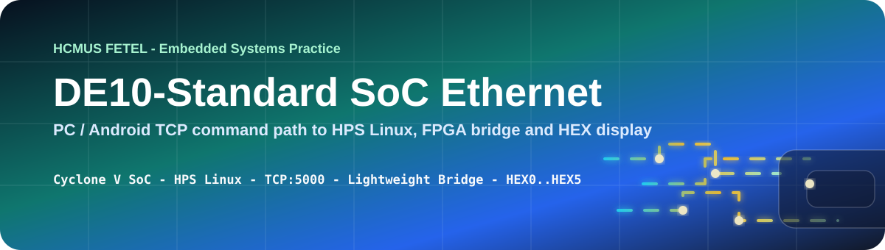
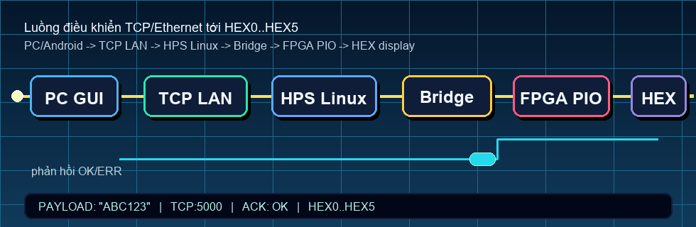

# SoC Ethernet Controller on Intel DE10-Standard

<p align="center">
  <a href="https://github.com/lhlizdabezt/DoAnHeThongNhung/releases/latest"></a>
  <a href="https://github.com/lhlizdabezt/DoAnHeThongNhung/tags"></a>
  
  
</p>

<p align="center">
  
</p>

<p align="center">
  
</p>

## Executive Summary

`DoAnHeThongNhung` is an embedded systems course project for the Intel DE10-Standard Cyclone V SoC board. The system accepts short text payloads from a PC or Android client over TCP/Ethernet, runs a lightweight server on the HPS Linux side, writes validated data through memory-mapped PIO registers, and displays the result on FPGA-driven seven-segment displays `HEX0` through `HEX5`.

This repository is presented as portfolio evidence for networked embedded systems, FPGA/SoC integration, Linux-side board control, TCP/IP command paths, and hardware/software debugging discipline. It is written for HR screening, engineering review, seminar review, and faculty-style technical inspection.

## Project Snapshot

| Field | Details |
|---|---|
| Repository | [github.com/lhlizdabezt/DoAnHeThongNhung](https://github.com/lhlizdabezt/DoAnHeThongNhung) |
| Project title | SoC Ethernet Controller on Intel DE10-Standard |
| Portfolio track | Embedded systems, FPGA/SoC, TCP/IP, network communications, Linux board control |
| Hardware platform | Terasic Intel DE10-Standard with Cyclone V SoC |
| Operating context | HPS Linux on the DE10-Standard board |
| FPGA output | Six seven-segment displays, `HEX0` through `HEX5` |
| TCP service | LAN server listening on port `5000` |
| Client tools | Python/Tkinter PC GUI and Android TCP client evidence |
| Hardware design | Quartus Prime, Platform Designer/Qsys, VHDL top level, PIO exports |
| Software path | Python socket client, board-side TCP server, `devmem` writes to PIO registers |
| Release page | [Latest release](https://github.com/lhlizdabezt/DoAnHeThongNhung/releases/latest) |
| Version history | [Tags](https://github.com/lhlizdabezt/DoAnHeThongNhung/tags) |
| Owner profile | [Luong Hai Long](https://github.com/lhlizdabezt) |

## What This Project Proves

| Evidence area | Repository evidence | Reviewer value |
|---|---|---|
| FPGA/SoC integration | `DoAn/de10_hex_text_ssh_project/hw/hdl/project.vhd`, Quartus/Qsys files and Platform Designer screenshots | Shows that the HPS, FPGA fabric and exported PIO signals are tied together in a real board project |
| Linux-side board control | `DoAn/s1.cpp`, `DoAn/s2.cpp`, `DoAn/s3.cpp` wrappers for the board TCP server flow | Shows command deployment to the board-side Linux environment |
| TCP/IP command path | `DoAn/pc_hex_tcp_pink_gui.py` and Android evidence images | Shows client-to-board communication over LAN on port `5000` |
| Hardware-visible output | `assets/20260420_155346.jpg`, `assets/Android.jpg`, `assets/Python.png` and seven-segment display photos | Shows that the software path reaches visible FPGA output |
| Documentation discipline | `17_TH_HTN_22DTV_CLC.pdf`, presentation files, release notes and visual assets | Shows report-backed, release-backed, inspectable engineering evidence |

## System Flow

| Stage | Technical object | Role in the system |
|---|---|---|
| 1 | PC client or Android client | Sends a short display payload over TCP in the same LAN |
| 2 | TCP socket on port `5000` | Provides a simple request/response channel to the board |
| 3 | HPS Linux process | Receives payloads, normalizes text and prepares PIO writes |
| 4 | Lightweight HPS-to-FPGA bridge | Provides the memory-mapped access path from HPS software to FPGA fabric |
| 5 | PIO registers | Hold active-low seven-segment codes for each display |
| 6 | `HEX5` through `HEX0` | Shows the normalized six-character payload on the physical board |

Short form for reviewers:

```text
PC or Android client -> TCP port 5000 -> HPS Linux -> Lightweight HPS-to-FPGA bridge -> PIO registers -> HEX5..HEX0
```

## Address Map Used by the Server

The board-side server writes one active-low seven-segment code per PIO register.

| PIO register | Address | Physical display |
|---|---:|---|
| `pio_hex0` | `0xFF200040` | `HEX0` |
| `pio_hex1` | `0xFF200050` | `HEX1` |
| `pio_hex2` | `0xFF200060` | `HEX2` |
| `pio_hex3` | `0xFF200070` | `HEX3` |
| `pio_hex4` | `0xFF200080` | `HEX4` |
| `pio_hex5` | `0xFF200090` | `HEX5` |

The payload is normalized to a maximum of six characters. Supported display characters include digits, selected uppercase letters, hyphen, underscore and blank space.

## Repository Structure

| Path | Purpose |
|---|---|
| `README.md` | Public US English reviewer guide for the repository |
| `RELEASE_NOTES.md` | Current release notes for the latest portfolio snapshot |
| `assets/` | Self-hosted images, SVG banners and GIF motion assets used by the README and profile |
| `scripts/render_soc_ethernet_flow.py` | Repeatable renderer for the line-free animated flow GIF |
| `DoAn/pc_hex_tcp_pink_gui.py` | Python/Tkinter PC client for sending payloads to the board |
| `DoAn/s1.cpp` | Shell wrapper content that writes the board-side TCP server script |
| `DoAn/s2.cpp` | Shell wrapper content that writes the board-side start script |
| `DoAn/s3.cpp` | Shell command wrapper for starting the board-side service |
| `DoAn/de10_hex_text_ssh_project/` | DE10-Standard hardware/software project tree with Quartus, Qsys, VHDL, HPS Linux and SD card material |
| `DoAn/de10_hex_text_ssh_project/hw/hdl/project.vhd` | VHDL top level wiring PIO exports to LEDs and seven-segment displays |
| `17_TH_HTN_22DTV_CLC.pdf` | Technical report artifact from the original coursework submission |
| `17_TH_HTN_22DTV_CLC_presentation.pdf` | Presentation artifact for seminar or defense review |
| `SoC_Ethernet_Integration_Blueprint.pptx` | PowerPoint blueprint artifact for the system presentation |

## How To Review the Project

1. Read the [Executive Summary](#executive-summary) and [Project Snapshot](#project-snapshot) to understand scope.
2. Inspect `assets/soc-ethernet-flow.gif` and the evidence photos under `assets/` for visible board/client proof.
3. Open `DoAn/pc_hex_tcp_pink_gui.py` to review the PC client, timeout behavior and request/response handling.
4. Open `DoAn/s1.cpp` to review the server logic, payload normalization and PIO address writes.
5. Open `DoAn/de10_hex_text_ssh_project/hw/hdl/project.vhd` to verify that the Platform Designer PIO exports reach `HEX0` through `HEX5`.
6. Review the release page and tags to confirm the repository has stable public snapshots.
7. Use the FAQ and boundaries below to separate proven prototype behavior from production features not claimed here.

## How To Run the PC Client

The PC client is intended for a LAN where the DE10-Standard board is already booted, connected by Ethernet and running the board-side TCP server.

```powershell
cd DoAn
python .\pc_hex_tcp_pink_gui.py
```

Recommended review steps:

1. Confirm the board IP address from the HPS Linux terminal.
2. Start the server on the DE10-Standard board.
3. In the PC GUI, set the board IP and port `5000`.
4. Send a short value such as `ABC123`, `HELLO-` or `P-0001`.
5. Confirm that the server replies with `OK:<payload>` and that `HEX5..HEX0` shows the normalized payload.

## Board-Side Service Notes

The repository stores the board-side command wrappers under `DoAn/` because the original workflow writes the runnable scripts into `/tmp` on the HPS Linux environment.

| File | Role |
|---|---|
| `DoAn/s1.cpp` | Writes `/tmp/board_tcp_hex_server.py` on the board |
| `DoAn/s2.cpp` | Writes `/tmp/start_board_tcp_hex_server.sh` on the board |
| `DoAn/s3.cpp` | Starts the board-side server |

The server listens on `0.0.0.0:5000`, decodes incoming UTF-8 payloads, normalizes unsupported characters to blanks, limits output to six characters, writes six PIO registers with `devmem`, and returns either `OK:<payload>` or `ERR:<reason>`.

## Visual Evidence

| Visual | Purpose |
|---|---|
| `assets/soc-ethernet-hero.svg` | Line-free English SVG banner for GitHub README rendering |
| `assets/soc-ethernet-flow.gif` | Line-free animated GIF showing the staged command path |
| `assets/Python.png` | PC GUI evidence image |
| `assets/Android.jpg` | Android client evidence image |
| `assets/platform_designer.png` | Platform Designer evidence image |
| `assets/board_connections.jpg` | Board connection evidence image |
| `assets/de10_standard.jpg` | DE10-Standard board reference image |

Visual assets are intentionally self-hosted in this repository. SVG text is ASCII-safe English, and the current GIF avoids moving connector lines, dotted lines, dashed lines and decorative paths behind text.

## Scope and Boundaries

This is a team coursework prototype and portfolio evidence artifact. The repository does not claim production deployment, internet-facing access, NAT traversal, production security hardening, a custom kernel driver, real-time safety certification or commercial readiness.

The system is best understood as a LAN-based embedded-system control demonstration: socket input from a client, Linux-side payload handling on the HPS, memory-mapped writes over the lightweight HPS-to-FPGA bridge, and visible output on FPGA-driven seven-segment displays.

## Role and Portfolio Context

Luong Hai Long maintains this public GitHub packaging as evidence of embedded systems, network communications and FPGA/SoC integration work. The technical emphasis is reviewer-facing and evidence-first: hardware platform, address map, source files, visual proof, release snapshots and explicit prototype limits.

## Release, Tags and Topics

| Item | Link |
|---|---|
| Latest release | [github.com/lhlizdabezt/DoAnHeThongNhung/releases/latest](https://github.com/lhlizdabezt/DoAnHeThongNhung/releases/latest) |
| Version tags | [github.com/lhlizdabezt/DoAnHeThongNhung/tags](https://github.com/lhlizdabezt/DoAnHeThongNhung/tags) |
| Repository homepage | [Latest release page](https://github.com/lhlizdabezt/DoAnHeThongNhung/releases/latest) |
| Owner profile | [github.com/lhlizdabezt](https://github.com/lhlizdabezt) |

Recommended topics for this repository include `embedded-systems`, `fpga`, `soc`, `cyclone-v`, `de10-standard`, `tcp-ip`, `ethernet`, `linux`, `vhdl`, `quartus`, `platform-designer`, `hps-fpga-bridge`, `pio`, `seven-segment-display`, `python`, `tkinter`, `electronics`, `telecommunications` and `hcmus`.

## Contact and Professional Links

| Channel | Link |
|---|---|
| GitHub | [github.com/lhlizdabezt](https://github.com/lhlizdabezt) |
| LinkedIn | [linkedin.com/in/lhlizdabezt](https://www.linkedin.com/in/lhlizdabezt) |
| Resume | [Profile README resume link](https://github.com/lhlizdabezt/lhlizdabezt/blob/main/resume/Luong_Hai_Long_CV.pdf) |
| Work email | [luonghailong.work@gmail.com](mailto:luonghailong.work@gmail.com) |
| Student email | [22207056@student.hcmus.edu.vn](mailto:22207056@student.hcmus.edu.vn) |
| Phone | [+84 988 114 708](tel:+84988114708) |
| Facebook | [facebook.com/wageseadrake](https://www.facebook.com/wageseadrake) |
| Instagram | [instagram.com/lhlizdabezt](https://www.instagram.com/lhlizdabezt) |
| YouTube | [youtube.com/@lhlizdabezt](https://www.youtube.com/@lhlizdabezt) |
| TikTok | [tiktok.com/@wageseadrake](https://www.tiktok.com/@wageseadrake) |

## FAQ

### Is this a production embedded product?

No. It is a LAN-based academic prototype and portfolio artifact. The value is in the HPS-to-FPGA integration, TCP/IP command path, address-map reasoning and visible board output.

### Why use TCP instead of a direct serial-only workflow?

TCP/Ethernet proves that the board can receive commands from multiple client types on the same network. The Android evidence is useful because it shows that the board-side service is not limited to one PC GUI.

### Why write to PIO registers with `devmem`?

For this prototype, `devmem` provides a direct and inspectable way to demonstrate memory-mapped HPS-to-FPGA writes without adding a custom kernel driver.

### What is the most important file for engineering review?

Start with `DoAn/s1.cpp` for the board-side command path, `DoAn/pc_hex_tcp_pink_gui.py` for the PC client, and `DoAn/de10_hex_text_ssh_project/hw/hdl/project.vhd` for the hardware wiring to `HEX0..HEX5`.

### What should a reviewer check on the board?

Confirm the HPS Linux IP address, confirm the TCP server is listening on port `5000`, send a six-character payload, read the `OK` or `ERR` response, and compare the physical seven-segment display with the normalized payload.

### Why are there report and presentation files?

They preserve the original coursework evidence and make the repository easier to audit in seminar, faculty and portfolio contexts.

## Writing and Review Standard

This README follows an evidence-first professional style: concrete technical nouns, defensible claims, visible source paths, bounded prototype language, release-backed assets and no inflated claims beyond what the repository can support.
